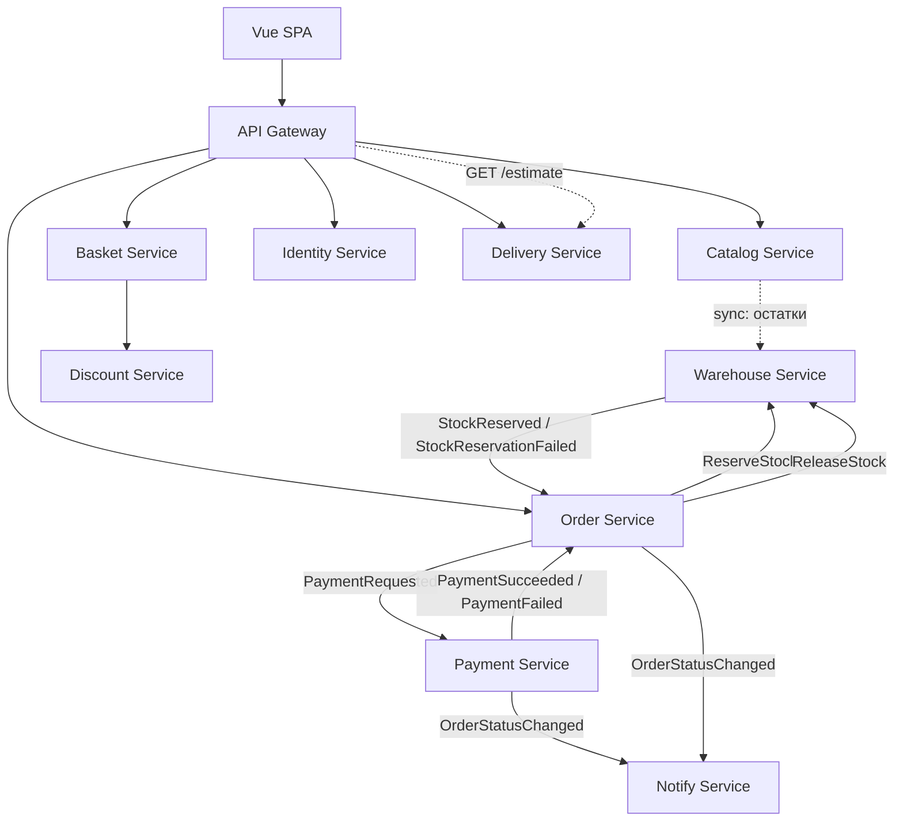

# 1. Общее описание системы

Интернет‑магазин с микросервисной архитектурой:

* Backend на C# / .NET.
* Основная БД — PostgreSQL с ORM (Entity Framework Core).
* Redis для кэша и корзины.
* RabbitMQ для асинхронного взаимодействия между сервисами.
* Vue как фронтенд.
* Всё разворачивается в Docker (локально через docker-compose).
* Grafana + (Prometheus/InfluxDB) для метрик.
* ELK‑стек (Elasticsearch + Logstash + Kibana) для логов.

Цель: стек полностью оправдан функционалом, без лишних технологий «ради галочки».

# 2. Технологический стек и его роль

## 2.1. Backend

* C# / .NET 10 (ASP.NET Core)  
**Роль**: реализация всех микросервисов и API‑шлюза.

* ORM (Entity Framework Core)  
**Роль**: работа с PostgreSQL, миграции, модели домена, репозитории.

## 2.2. Хранение данных

* PostgreSQL
  * Каталог товаров.
  * Пользователи.
  * Заказы.
  * Складские остатки.
  * Платежи.
  * Доставка (зоны, расчёты).
* Redis
  * Корзина (быстрый доступ, краткоживущие данные).
  * Кэш каталога (список товаров, остатки).
  * Опционально: сессии, rate limiting.

## 2.3. Интеграция и асинхронность

* RabbitMQ
  * События между сервисами:
    * `OrderCreated`, `StockReserved`, `StockReservationFailed`,
    * `PaymentRequested`, `PaymentSucceeded`, `PaymentFailed`,
    * `DeliveryCalculationRequested`, `DeliveryTimeCalculated`,
    * `OrderStatusChanged`, и т.д.
  * Обеспечивает слабую связанность и надёжный обмен сообщениями.

## 2.4. Наблюдаемость

* Grafana — Используется для визуализации метрик:
  * Количество заказов.
  * Успешные/неуспешные оплаты.
  * Время ответа сервисов.
  * Очереди RabbitMQ (длина, скорость обработки).
  * Нагрузка на БД.
* ELK (Elasticsearch, Logstash, Kibana)
  * Logstash собирает логи из всех микросервисов (например, через Filebeat или прямой output).
  * Elasticsearch хранит структурированные логи.
  * Kibana даёт дашборды и поиск по логам:
    * Ошибки оплаты.
    * Ошибки резервирования склада.
    * Трассировка запросов (correlation id).

## 2.5. Frontend

* Vue
  * SPA или классический фронт.
  * Основные страницы:
    * Каталог товаров.
    * Корзина.
    * Регистрация/логин.
    * Оформление заказа.
    * Личный кабинет (история заказов).

## 2.6. Надёжность событий (Transactional Outbox)

Каждый микросервис использует паттерн **Transactional Outbox** для гарантированной доставки событий в RabbitMQ.

**Проблема**: сервис записывает данные в БД и публикует событие в MQ двумя отдельными операциями. При падении процесса между ними событие теряется, данные рассинхронизируются.

**Решение**:
* Событие сохраняется в таблицу `outbox_events` в **той же транзакции**, что и основные данные.
* Отдельный фоновый процесс (Outbox Relay) читает непубликованные записи и отправляет их в RabbitMQ.
* После успешной публикации запись помечается как `published`.

**Модель данных** (в каждом сервисе, где публикуются события):

* `outbox_events` (id, event_type, payload, created_at, published_at)

## 2.7. Идемпотентность обработчиков

RabbitMQ гарантирует доставку **at-least-once** — одно сообщение может прийти дважды. Без защиты это приводит к двойному резервированию товара, двойному списанию и т.д.

**Решение**: каждый обработчик события перед обработкой проверяет, не было ли уже обработано это сообщение.

**Модель данных** (в каждом сервисе, где потребляются события):

* `processed_messages` (message_id, processed_at)

**Алгоритм**:
1. Проверить наличие `message_id` в `processed_messages`.
2. Если есть — пропустить (ack сообщение).
3. Если нет — выполнить обработку и сохранить `message_id` в **той же транзакции**.

## 2.8. Docker

* Каждый сервис — отдельный контейнер:
  * `api-gateway`, `catalog-service`, `basket-service`, `order-service`, `payment-service`, `warehouse-service`, 
  `delivery-service`, `identity-service`, `notification-service` (опционально), `redis`, `postgres`, `rabbitmq`, 
  `grafana`, `prometheus`, `elasticsearch`, `logstash`, `kibana`, `frontend`.
* docker-compose.yml описывает всю инфраструктуру для локального запуска.

# 3. Микросервисная архитектура

## 3.1. API Gateway / Web Backend

**Ответственность**:

* Единая точка входа для фронтенда (Vue).
* Маршрутизация запросов к микросервисам.
* Аутентификация (JWT).
* Агрегация данных (например, собрать заказ + статус оплаты + ETA доставки).

**Примеры эндпоинтов**:

* GET /api/catalog/products
* GET /api/catalog/products/{id}
* GET /api/basket
* POST /api/basket/items
* POST /api/checkout
* GET /api/orders/{id}
* GET /api/delivery/estimate?orderId=...
* POST /api/auth/register
* POST /api/auth/login

## 3.2. Identity Service (Пользователи и регистрация)

**Требование**: оплата возможна только после регистрации.

**Ответственность:**

* Регистрация, логин, управление пользователями.
* Выдача JWT токенов.

**Модель данных (PostgreSQL):**

* users (id, email, password_hash, name, address, phone, created_at, ...)

**Функционал**:

* POST /auth/register
* POST /auth/login
* Проверка токена для защищённых операций (оформление заказа, оплата).

## 3.3. Catalog Service (Каталог товаров)

**Ответственность**:

* Описание товаров: название, цена, описание, категория, изображения.
* Не хранит реальные остатки — только «каталог».

**Модель данных**:

* products (id, name, description, price, sku, is_active, created_at, updated_at, ...)
* categories (id, name, ...)

**Интеграция**:

* Для отображения «есть на складе»:
  * Либо запрашивает Warehouse Service.
  * Либо получает периодические обновления и кэширует остатки в Redis.

## 3.4. Warehouse Service (Склад)

**Ответственность**:

* Хранение и управление остатками.
* Проверка наличия товара.
* Резервирование и освобождение товара.

**Модель данных**:

* `stock_items` (id, product_id, quantity_available, reserved, warehouse_location, ...)

**События (RabbitMQ)**:

* ReserveStock(orderId, items)
* StockReserved(orderId)
* StockReservationFailed(orderId, reason)
* ReleaseStock(orderId)
* StockReleased(orderId)

**Rollback**:  
При `PaymentFailed(orderId)` сервис снимает резерв и возвращает товар в `quantity_available`.

## 3.5. Basket Service (Корзина)

**Ответственность**:

* Хранение корзины до оформления заказа.

**Хранение (Redis)**:

* Ключ: `basket:{userId}` или `basket:{sessionId}`.
* Значение: список `{ productId, quantity, priceSnapshot }`.

**API**:

* GET /basket
* POST /basket/items
* DELETE /basket/items/{productId}
* DELETE /basket

## 3.6. Order Service (Заказы)

**Ответственность**:

* Создание и управление заказами.
* Статусы: Created, StockReserved, PaymentPending, Paid, Failed, Cancelled, ReadyForShipment, ...

**Модель данных**:

* orders (id, user_id, status, total_price, created_at, updated_at, delivery_address, delivery_eta, delivery_price, ...)
* order_items (id, order_id, product_id, quantity, price, ...)

**События**:

* OrderCreated(orderId, items)
* PaymentRequested(orderId, amount, paymentMethod)
* PaymentSucceeded(orderId)
* PaymentFailed(orderId)

## 3.7. Payment Service (Оплата)

**Ответственность**:

* Имитация платёжного шлюза.
* Обработка запросов на оплату.

**Модель данных**:

* payments (id, order_id, amount, status, payment_method, transaction_id, created_at, ...)

**Логика**:

* Получает PaymentRequested(orderId, amount, paymentMethod).
* Пытается провести оплату (можно сделать рандомный успех/провал).
* Успех → PaymentSucceeded(orderId).
* Неудача → PaymentFailed(orderId).

**Rollback**:

* На PaymentFailed(orderId) Order Service меняет статус заказа, Warehouse Service освобождает резерв — товар 
возвращается на склад.

## 3.8. Delivery Service (Доставка и расчёт времени)

Можно объединить «сервис доставки» и «сервис расчёта времени доставки» в один, чтобы стек не был избыточным.

**Ответственность**:

* Расчёт времени доставки (ETA) и стоимости.
* Хранение зон доставки.

**Модель данных**:

* delivery_zones (id, name, base_eta_days, base_price, ...)
* delivery_calculations (id, order_id, eta, price, created_at, ...)

**API**:

* GET /delivery/estimate — синхронный расчёт ETA и стоимости до оплаты.

Результат сохраняется в `delivery_calculations` для истории. Order Service фиксирует данные при создании заказа и не обращается к Delivery Service после оплаты.

## 3.9. Дополнительные сервисы (идеи)

Чтобы проект был интереснее, но без лишнего стека:

* **Notification Service (уведомления)**:
  * Email/Telegram‑уведомления:
    * «Заказ создан», «Оплата прошла», «Заказ отменён».
  * Подписка на OrderStatusChanged.
* **Discount Service (скидки/промокоды)**:
  * Промокоды, акции.
  * Интеграция с Basket Service и Order Service.
* **Analytics/Reporting Service**:
  * Сбор агрегированных данных:
    * Количество заказов по дням.
    * Конверсия (сколько корзин → сколько оплат).
  * Можно использовать те же метрики, что идут в Grafana.

# 4. Основные бизнес‑процессы

## 4.1. Просмотр каталога и корзина

1. Пользователь открывает сайт (Vue).
2. Vue → GET /api/catalog/products.
3. API Gateway → Catalog Service.
4. Catalog Service:
    * Читает товары из PostgreSQL.
    * Может дополнительно запросить Warehouse Service для актуальных остатков.
    * Кэширует результат в Redis.
5. Пользователь добавляет товар в корзину:
   * Vue → POST /api/basket/items.
   * Basket Service сохраняет корзину в Redis.

## 4.2. Оформление заказа и регистрация

1. Пользователь переходит в корзину → GET /api/basket.
2. Вводит данные (ФИО, адрес, телефон), выбирает способ оплаты.
3. Если пользователь не зарегистрирован:
   * Vue → POST /api/auth/register / POST /api/auth/login.
   * Получает JWT.
4. Фронт запрашивает расчёт доставки:
   * Vue → GET /api/delivery/estimate (адрес + список товаров из корзины).
   * Delivery Service возвращает ETA и стоимость синхронно (или через быстрый асинхронный вызов).
   * Пользователь видит итоговую стоимость **до оплаты**.
5. Нажимает «Оформить заказ»:
   * Vue → POST /api/checkout (с JWT, snapshot корзины, выбранный способ оплаты, подтверждённая стоимость доставки).
   * Фронт передаёт позиции корзины в теле запроса — Order Service не обращается к Basket Service напрямую.
   * API Gateway → Order Service:
     * Создаёт заказ (status = Created), фиксирует delivery_eta и delivery_price из запроса.
     * Публикует OrderCreated / ReserveStock.

## 4.3. Проверка наличия товара и резервирование

1. Warehouse Service получает ReserveStock(orderId, items):
    * Проверяет quantity_available по каждому товару.
2. Если достаточно:
   * Резервирует (уменьшает quantity_available, увеличивает reserved).
   * Публикует StockReserved(orderId).
3. Если нет:
   * Публикует StockReservationFailed(orderId, reason).
   * Order Service ставит заказ в статус Failed/Cancelled.
   * Фронт показывает сообщение «Недостаточно товара».

## 4.4. Оплата и rollback

1. Order Service при StockReserved(orderId):
    * Статус PaymentPending.
    * Публикует PaymentRequested(orderId, amount, paymentMethod).
2. Payment Service:
    * Пытается провести оплату.
    * Успех → PaymentSucceeded(orderId).
    * Неудача → PaymentFailed(orderId).
3. Order Service:
    * При PaymentSucceeded → статус Paid → ReadyForShipment (delivery_eta и delivery_price уже зафиксированы при создании заказа).
    * При PaymentFailed → статус Failed, публикует ReleaseStock(orderId).
4. Warehouse Service:
   * При ReleaseStock(orderId):
     * Уменьшает reserved, увеличивает quantity_available.
     * Товар возвращается на склад — rollback.

## 4.5. Расчёт времени доставки

Расчёт ETA и стоимости доставки выполняется **до оформления заказа** (см. п. 4.2, шаг 4), чтобы пользователь видел итоговую сумму перед оплатой.

При создании заказа Order Service фиксирует delivery_eta и delivery_price из запроса `POST /checkout` — повторного расчёта после оплаты не требуется.

**Delivery Service** обрабатывает синхронный запрос:
* GET /api/delivery/estimate?address=...&items=...
* Рассчитывает ETA и стоимость на основе delivery_zones.
* Сохраняет расчёт в `delivery_calculations` для истории.
* Возвращает результат напрямую (без очереди).

# 5. Наблюдаемость: метрики и логи

## 5.1. Метрики (Grafana)

* **Инфраструктурные**:
  * CPU/Memory по сервисам.
  * Время ответа HTTP‑эндпоинтов.
* **Бизнес‑метрики**:
  * Количество заказов в статусах (Created, Paid, Failed).
  * Количество неуспешных оплат.
  * Среднее время:
    * от OrderCreated до PaymentSucceeded.
    * от PaymentSucceeded до DeliveryTimeCalculated.
* **RabbitMQ**:
  * Длина очередей.
  * Скорость обработки сообщений.

## 5.2. Логи (ELK)

* Каждый микросервис пишет структурированные логи (JSON) с полями:
  * timestamp, service, level, message, correlation_id, order_id, user_id, exception.
* Logstash/Filebeat собирает логи и отправляет в Elasticsearch.
* Kibana:
  * Дашборды по ошибкам.
  * Фильтрация по correlation_id для трассировки одного запроса через все сервисы.

# 6. Схема архитектуры

