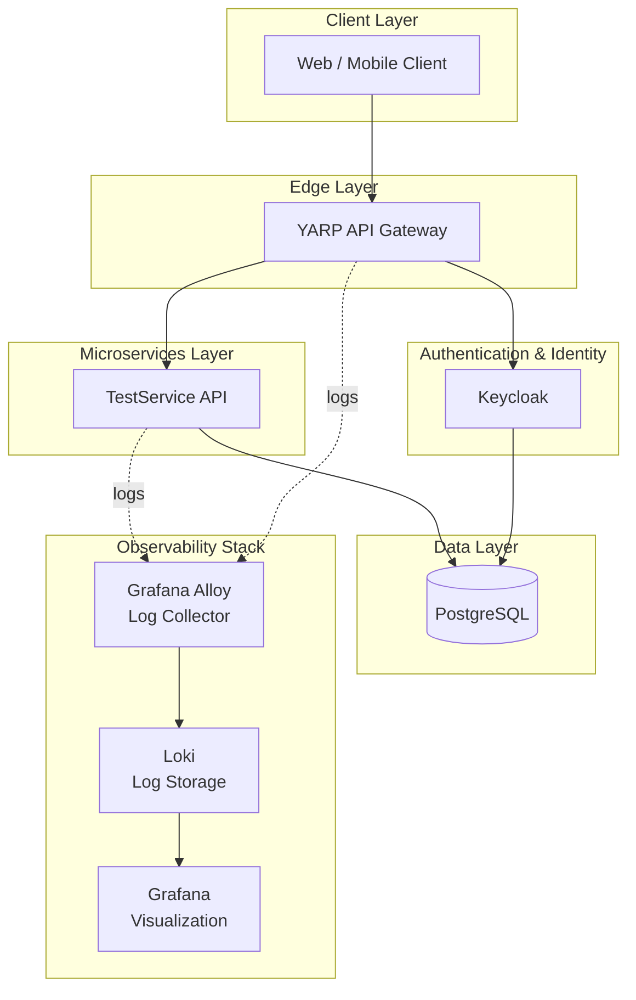

README.md

## Описание проекта

InternetShop — учебный проект микросервисной архитектуры на ASP.NET Core. В состав входят API Gateway (YARP), тестовый микросервис, Keycloak для аутентификации, PostgreSQL и стек логирования Grafana + Loki + Alloy.  
README.md

### Архитектура


## Первый запуск

```
git clone <repository>

cd InternetShop

docker compose up -d --build
```

После первого запуска автоматически:

- создаётся PostgreSQL;
- создаются базы данных;
- импортируется Realm в Keycloak;
- запускается Loki;
- запускается Alloy;
- запускается Grafana, создаётся connection Loki;
- собираются и запускаются микросервисы.

## Доступные сервисы

| Сервис      | URL                                            |
| ----------- | ---------------------------------------------- |
| API Gateway | [http://localhost:5000](http://localhost:5000) |
| Keycloak    | [http://localhost:8080](http://localhost:8080) |
| Grafana     | [http://localhost:3000](http://localhost:3000) |
| Loki        | [http://localhost:3100](http://localhost:3100) |

## Учётные записи
Grafana
```
login: admin
password: admin
```
Keycloak
```
login: admin
password: admin
```
Пользователь  realm InternetShop для тестирования api
```
login: admin
password: 123
```
## Проверка работы системы
1. Открыть swagger сервиса test-api  
Перейти по ссылке http://localhost:5000/api/test/swagger/index.html

2. Получить JWT токен  
Выполнить  
[POST] /autch/login  
```JSON
{
  "username": "admin",
  "password": "123"
}
```
3. Скопировать полученный access_token
4. Нажать Authortize, вставить access_token,  авторизоваться.
5. Создать тестовый продукт 
Выполнить  
[POST] /products
```
{
  "name": "test product",
  "price": 888
}
```
6. Получить все продуты.  
Выполнить  
[GET] /products

## Полезные команды

Например

Запустить
``` PowerShell
docker compose up --build
```

Остановить
``` PowerShell
docker compose down
```

Остановить и удалить тома
``` PowerShell
docker compose down -v
```

Просмотреть логи
``` PowerShell
docker compose logs -f
```

Пересобрать сервис
``` PowerShell
docker compose up --build test-service

docker compose up --build api-gateway
```

``` PowerShell
docker compose build --no-cache api-gateway
```
